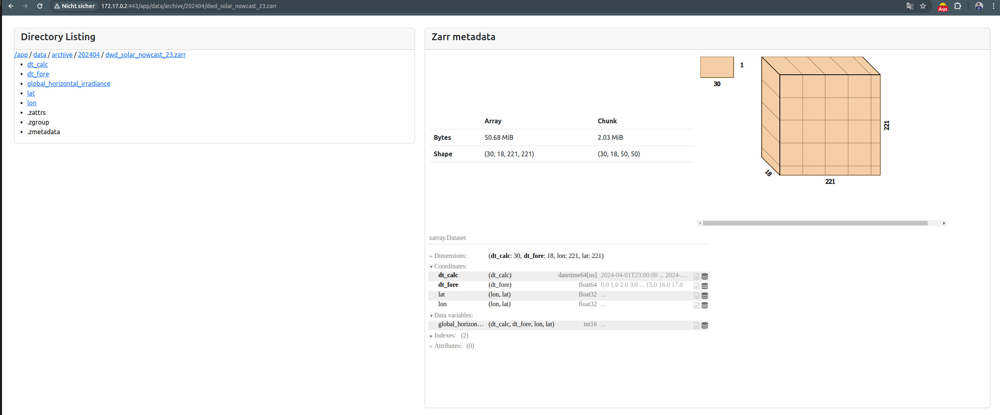

# Zarr-Browser

## What is it for?
The Zarr-Browser helps you navigate through the file system of multiple Zarr archives. It provides detailed information about available Zarr archives and their metadata.




## Getting Started

The Zarr-Browser is a containerized web application using Plotly Dash and supports running the app with FastAPI. You need to define the root directory that will be mounted into the container. This directory must be pointed to `/app/data` within the container.

### 1. Build the Docker Image

To build the Docker image, run the following command:

```bash
docker build -t zarr_browser .
```

### 2. Run the App

You must ensure that the volume mount points to the directory you have configured as the `ROOT_DIR` environment variable.

#### Run the Plotly Dash App

To run the Plotly Dash app, use the following CLI command:

```bash
docker run --name zarr_browser --rm -v $(pwd):/app -v {path_to_your_root_directory}:/app/data -p 443:443 zarr_browser:latest python3 /app/zarr_browser/app.py
```

After running the command, open your browser and navigate to:

```
http://localhost:443/
```

#### Run the Plotly Dash App within a FastAPI

To run the Plotly Dash app within a FastAPI environment, use the following CLI command:

```bash
docker run --name zarr_browser --rm -v $(pwd):/app -v {path_to_your_root_directory}:/app/data -p 443:443 zarr_browser:latest hypercorn zarr_browser.main:app --bind 0.0.0.0:443 --workers 4
```

After running the command, open your browser and navigate to:

```
http://localhost:443/
```

Make sure to replace `{path_to_your_root_directory}` with the actual path to your root directory containing the Zarr archives.

### Notes

- Ensure Docker is installed and running on your machine.
- The `ROOT_DIR` environment variable should be set to the directory you want to navigate through with the Zarr-Browser.
- Adjust the port mappings (`-p 443:443`) as needed to avoid conflicts with other services running on your machine.

### 3. Running with SSL Certificates from Certbot

To run the container with SSL certificates from Certbot, you need to have the SSL certificates (`fullchain.pem` and `privkey.pem`) generated by Certbot. Follow these steps:

1. **Generate SSL Certificates with Certbot** (if you haven't already):

   Follow the instructions on the [Certbot website](https://certbot.eff.org/) to generate SSL certificates for your domain. This typically involves a command like:

   ```bash
   sudo certbot certonly --standalone -d yourdomain.com
   ```

   Replace `yourdomain.com` with your actual domain name.

2. **Run the Docker Container with SSL Certificates**:

   Use the following command to run the container with the SSL certificates:

   ```bash
   docker run --name zarr_browser --rm \
       -v $(pwd):/app \
       -v {path_to_your_root_directory}:/app/data \
       -v /etc/letsencrypt/:/etc/ssl/letsencrypt/ \
       -p 443:443 zarr_browser:latest \
       hypercorn zarr_browser.main:app --bind 0.0.0.0:443 --workers 4 --keyfile /etc/ssl/letsencrypt/live/yourdomain.com/privkey.pem --certfile /etc/ssl/letsencrypt/live/yourdomain.com/fullchain.pem
   ```

   Replace `{path_to_your_root_directory}` with the path to your root directory containing the Zarr archives and `yourdomain.com` with your actual domain name.

3. **Access the Application**:

   Open your browser and navigate to:

   ```
   https://yourdomain.com
   ```

   This will ensure that your Zarr-Browser application is served over HTTPS using the SSL certificates from Certbot.

### Notes

- Ensure the paths to `fullchain.pem` and `privkey.pem` match where Certbot has saved your certificates.
- The `--keyfile` and `--certfile` options in the `hypercorn` command point to the SSL certificate and key files respectively.
- Adjust the port mappings and other configurations as needed to suit your environment.

## Contribute:

Please install `nox` to run the following session from the root directory of the project

```bash
nox -s black lint
```

## What's next: 

- Support s3 Object Store and other filesystems using s3fs and fsspec
- Add a login using flask-login
- provide image in dockerhub
- Enhanced visualisation
- Support multiple data locations
- Adding tests
- Multi-User and User Management
- API to access the data
